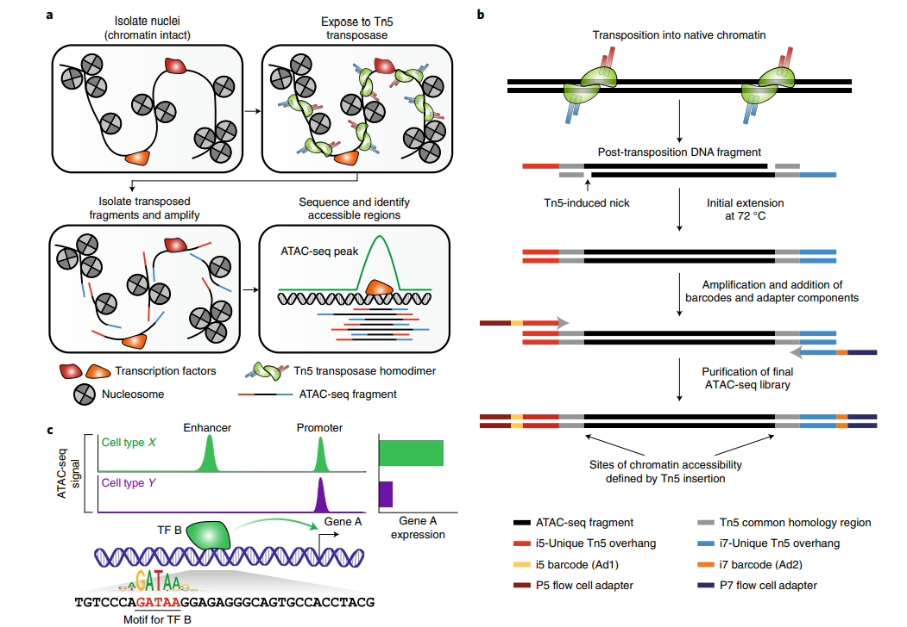

---
jupyter:
  jupytext:
    formats: ipynb,md
    text_representation:
      extension: .md
      format_name: markdown
      format_version: '1.3'
      jupytext_version: 1.14.1
  kernelspec:
    display_name: Python 3 (ipykernel)
    language: python
    name: python3
---

# I don't trust peaks
# Fragment-based modeling of ATAC-seq data


Hypotheses:
- There is more information in ATAC-seq data than can be extracted from peaks
- Ideally, we would extract this information in a completely unbiased fashion, and not look at shapes
- Looking at this levels improves interpretation of the data and/or prediction of other modalities


## Previous literature


Barely any really... Weird!


There are "shape-based" differential expression methods, as discussed here (https://genomebiology.biomedcentral.com/articles/10.1186/s13059-020-1929-3):

> Currently, most studies assume that ATAC-seq reads in peak regions follow a NB distribution, as is the case for RNA-seq data. However, no shape-based differential analysis tools exist for ATAC-seq data. The peaks contain not only read count information, but also the distribution shape profile. It is especially important for broad peaks, as broad peaks can contain multiple local maxima, and those shifts can indicate biologically relevant perturbations, which could be detected in sliding window or shape-based methods. Although not systematically studied, we believe incorporating shape information will improve differential peak analysis. Nevertheless, considering replicate handling, external peak caller dependency and backend statistical methods, csaw is worth a first try due to its easily explainable edgeR framework.

> Shape-based peak callers are not currently used in ATAC-seq, but they utilize read density profile information directly or indirectly and are believed to improve peak calling in ChIP-seq [73]. PICS [74] models fragment positions other than counts and calculate enrichment score for each candidate region. PolyaPeak [75] ranks peaks using statistics describing peak shape. CLC [76] learns a Gaussian filter for peak shape from positive and negative peaks.


The Gaussian mixture model is I think the closest method:


Still, none of these really work for single-cell, and they all needlessly make so many assumptions...


There are methods that look at windows of ATAC-seq (and count individual cut sites): https://www.biorxiv.org/content/10.1101/2022.03.16.484118v1 Not really super exciting...


Some denoising of scATAC-seq data using RNNs: https://www.nature.com/articles/s41467-021-21765-5: Seems interesting at first, but actually isn't.


There is some literature that discusses how promoter architecture influences the stochasticity of the downstream mRNAs
- https://www.biorxiv.org/content/10.1101/2021.10.29.466407v2.full.pdf


Guido suggested that the Signac authors found that using the whole gene body has better predictive ability than using promoter(?)


Some discussion on fragment length information content [here](https://seandavi.github.io/AtacSeqWorkshop/articles/Workflow.html#fragment-lengths)
> Finally, we expect nucleosome-free reads to be enriched near the TSS while mononucleosome reads should not be. We will use the heatmaps package to take a look at these two sets of reads with respect to the tss of the human genome.  
> Enrichment of nucleosome free reads just upstream of the TSS.  
> Depletion of nucleosome free reads just upstream of the TSS.  
>   
> (Buenrostro et al. 2013)  

Based on this information, isn't it weird that none of the methods can use this?


No real discussion in the [*pioneering* SHARE-seq paper ](https://www.sciencedirect.com/science/article/pii/S0092867420312538#!)


Some analysis pipelines seem to remove small fragments, not really sure why honestly... https://seandavi.github.io/AtacSeqWorkshop/articles/Workflow.html#data-import-and-quality-control


### Why do we aggregate over peaks?


It's historical...
- From bulk
  - We've got a couple of samples => power is extremely low! There's not much more that you can detect except "this peak is higher in this condition"
  - However, with single-cell ATAC-seq, there are much more possibilities for mechanistic/biophysical insights
- From ChIP-Seq
  - Where a binding event is more likely to be discrete
  - However, for ATAC-seq, this is almost certainly not gonna be true
- From classical statistics/data analysis
  - Where modeling intervals on sequences is just not easy. Classical data analysis requires matrices
  - But, as was shown for images and sequences, if you create a "gradient-proof" pipeline, you can do anything
- Based on a biological assumption
  - There are relatively static open chromatin regions (=enhancers) and these are the units of gene regulation
  - Might be, might not be... Did anyone check this hypothesis?


All in all, it might be worth exploring how a "peak-free" ATAC-seq (and others...) modeling framework would look like.

Just persuing this question, and proving that more information is retained, is already interesting. However, there are also several potential future applications:

- In TF-seq we are considering looking at the earliest time points of gene regulation, and how TF binding / open chromatin changes. It would be a shame if we would miss the earliest causal events simply because we aggregate over peaks....
- In the VCM team, we are considering generating single-cell ATAC-seq (multiome?) + genotype data. A fragment-based algorithm may pave the way for something like VCM2.0 or PHM2.0


## Technology: what?





It's paired end, see for reasons: https://informatics.fas.harvard.edu/atac-seq-guidelines.html#:~:text=For%20ATAC%2Dseq%2C%20we%20recommend,less%20accessible%20to%20the%20assay.


## Maths: how?


The data:
- $X$: the ATAC-seq data
  - $X_\text{fragments}$ A dataframe containing chromosome, start, end and cell (barcode)
  - $X_\text{seq}$: A set of sequences that are inside a fragment, or around cut sites, for each cell
- $Y$: any other cell data, e.g.:
  - $Y_\text{exp}$: The expression data. Counts. ~NegativeBinomial.
  - $Y_\text{ct}$: Celltype labels for each cell. ~OneHotCategorical.
  - $Y_\text{diff}$: A differentiationt time for each cell. Single number. ~LogitNormal.
- $Z$: A latent space of the cells


Overall we have three use cases
- $X \rightarrow Y$: Predicting/classifying using ATAC-seq data
- $Y \rightarrow X$: Predicting/classifying the ATAC-seq data
- $X \rightarrow Z \rightarrow X$: Unsupervised learning of ATAC-seq data

The unsupervised learning task is essentially a combination of the two prediction tasks.


### $X\rightarrow Z$


#### fragments [fragment]

$\text{fe}_{[\text{fragment}, \text{component}]} = f_{\theta_1}(\text{fragment})$

$\text{cge}_{[\text{cell}, \text{gene}, \text{component}]} = f_{\theta_2}(\text{fe})$, pooling per cell per gene

$\text{gex} = f_{\theta_2}(\text{cge})$, inclusion of gene information


## Biology: why?


Some positive controls


### Pausing at 50 bp


The polymerase often pauses at 50bp, waiting for some methylation according to Guido.
Julia Zeitlinger is working on this (https://www.stowers.org/scientists/julia-zeitlinger)
This pausing should be visibile with ATAC, but should be negatively correlated with expression.

Check out: https://www.nature.com/articles/ng.3867

This is a nice example of distance-based information that could be picked up by the neural network.
However, how sure are we of the TSS? Could we include knowledge of multiple possible TSS somehow?


How to test whether the neural network picks this up? Removing fragments shortly after the TSS should increase the expression prediction?


## Datasets


### 10X example datasets


https://www.10xgenomics.com/resources/datasets?query=&page=1&configure%5Bfacets%5D%5B0%5D=chemistryVersionAndThroughput&configure%5Bfacets%5D%5B1%5D=pipeline.version&configure%5BhitsPerPage%5D=500&configure%5BmaxValuesPerFacet%5D=1000&menu%5Bproducts.name%5D=Single%20Cell%20Multiome%20ATAC%20%2B%20Gene%20Expression


### Public


### SHARE-seq https://www.sciencedirect.com/science/article/pii/S0092867420312538

```python

```
