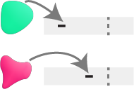

ChromatinHD analyzes single-cell ATAC+RNA data using the raw fragments as input,
by automatically adapting the scale at which
relevant chromatin changes on a per-position, per-cell, and per-gene basis.
This enables identification of functional chromatin changes
regardless of whether they occur in a narrow or broad region.

As we show in [our paper](https://www.biorxiv.org/content/10.1101/2023.07.21.549899v1), ChromatinHD models are better able to capture functional chromatin changes that the typical approach, i.e. peak-calling + statistical analysis. This is because there are extensive functional accessibility changes both outside and within peaks.

ChromatinHD models can capture long-range interactions by considering fragments co-occuring within the same cell, as we highlight in [Figure 5 of our paper](https://www.biorxiv.org/content/10.1101/2023.07.21.549899v1),

ChromatinHD models can also capture changes in fragment size that are related to gene expression changes, likely driven by dense direct and indirect binding of transcription factors, as we highlight in [Figure 6 of our paper](https://www.biorxiv.org/content/10.1101/2023.07.21.549899v1).

Currently, the following models are supported:

    <a href="quickstart/2_pred">
    <article class="card">
        <header>
            <h2>Pred</h2>
        </header>
        

            
 To learn where and how accessibility is predictive for gene expression 

        
        

    </article>
    </a>
            <a href="quickstart/3_diff">
     <article class="card">
        <header>
            <h2>Diff</h2>
        </header>    
        

            
To understand the differences in accessibilty between cell types/states

        
        

    </article>
    </a>
    <article class="card disabled">
        <header>
            <h2>Time</h2>
        </header>    
        

            
To learn where and how accessibility is predictive over (pseudo)time

        
        

    </article>
    <article class="card disabled">
        <header>
            <h2>Dime</h2>
        </header>    
        

            
To learn the differences in accessibility over (pseudo)time

        
        

    </article>

